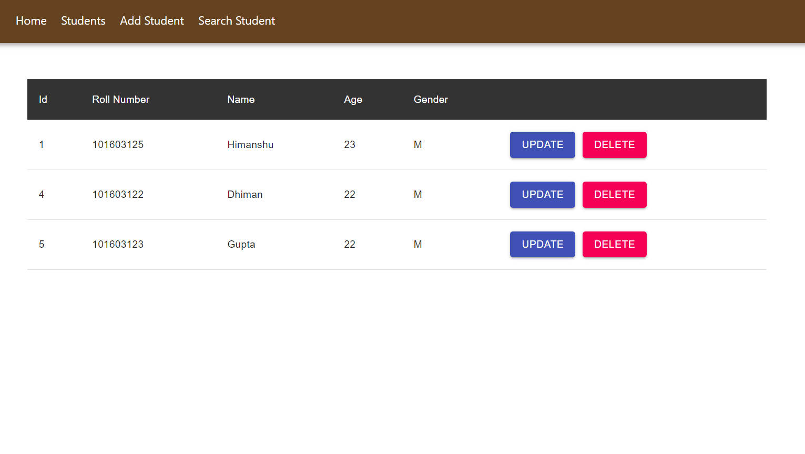

# Meddiff

This web application is developed using React.js, JSON server, Material UI and node.

Material UI is for React components for faster and easier web development.
JSON server for using JSON  to store student's data.
Node for using npm to setup.

Cpncurrently have been used to run react app and JSON server at the same time.

# Development Setup
Please download this folder.
Go to student folder and run these commands:
 npm install 
 npm i @material-ui/core
 npm i json-server 
 npm i concurrently

The setup is done.

Run npm run command for starting the application on port 3000 and JSON server on 3003.

# Application Snapshot

